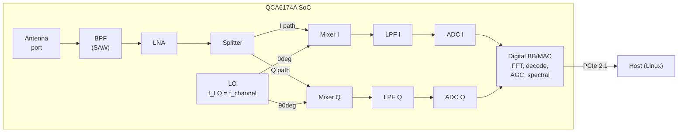
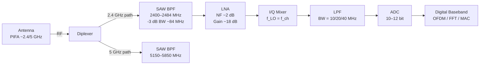
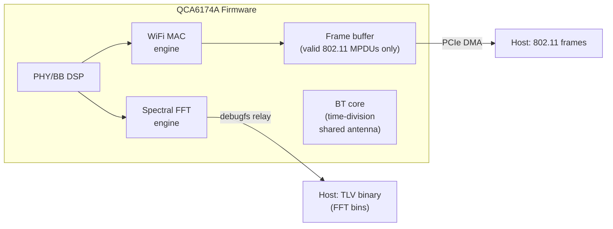
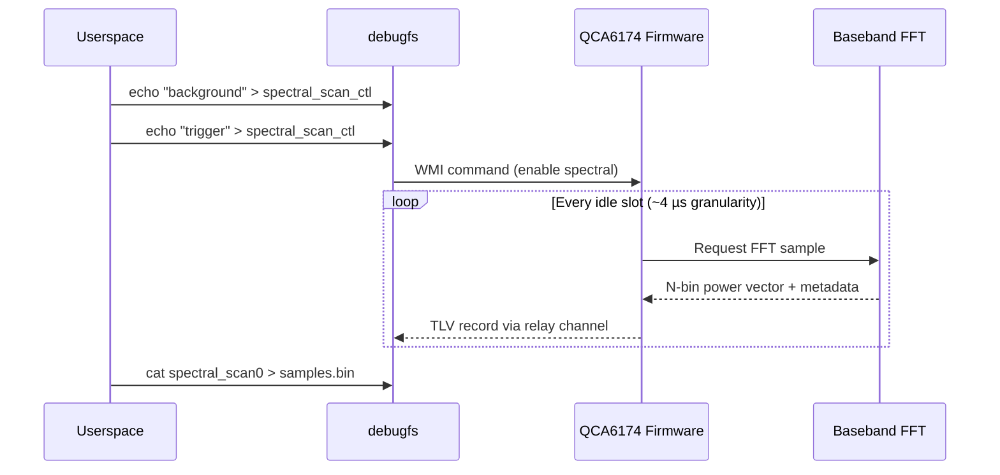
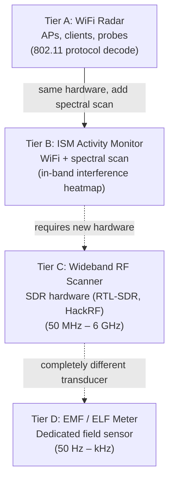

# RF Theory and Capability Assessment

**Subject:** Can a stock WiFi adapter detect general EMF, EM signals, and arbitrary RF transmitters?

**Hardware under test:** Qualcomm Atheros QCA6174A (rev 32), 2×2 MIMO 802.11a/b/g/n/ac + Bluetooth 5, PCIe 2.1 interface, driven by `ath10k_pci` on Linux (Arch).

**Date:** 2026-08-19

---

## Table of Contents

1. [Executive Summary](#1-executive-summary)
2. [The QCA6174A: Hardware Identification](#2-the-qca6174a-hardware-identification)
3. [Receiver Architecture: Direct Conversion (Zero-IF)](#3-receiver-architecture-direct-conversion-zero-if)
4. [Signal Chain: From Antenna to ADC](#4-signal-chain-from-antenna-to-adc)
5. [What "Ignore" Means: Physics of Band Rejection](#5-what-ignore-means-physics-of-band-rejection)
6. [Firmware and Driver: The Digital Wall](#6-firmware-and-driver-the-digital-wall)
7. [Spectral Scan: The One Window Beyond 802.11 Frames](#7-spectral-scan-the-one-window-beyond-80211-frames)
8. [CSI and Raw IQ: Research Frontiers](#8-csi-and-raw-iq-research-frontiers)
9. [What Can and Cannot Be Detected](#9-what-can-and-cannot-be-detected)
10. [Honest Capability Tiers](#10-honest-capability-tiers)
11. [Implications for wifi-radar](#11-implications-for-wifi-radar)
12. [References](#12-references)

---

## 1. Executive Summary

A WiFi adapter is a **narrow-band, protocol-specific receiver**. It is not a general-purpose EMF meter, spectrum analyzer, or arbitrary-transmitter detector. Its analog front-end physically rejects signals outside the 2.4 GHz and 5 GHz ISM/UNII bands. Its firmware only decodes 802.11 frames. However, the QCA6174A in this machine supports **spectral scan** — a hardware FFT feature that reports per-bin power across the currently-tuned channel bandwidth (up to 80 MHz). This allows detection of **in-band non-WiFi energy** (Bluetooth, Zigbee, microwave leakage, video transmitters) as unclassified interference, without identifying the source protocol.

**Bottom line:** the adapter is a **WiFi-band activity sensor**, not an "all EM" detector. Extending it to detect FM, cellular, power-line fields, or sub-GHz transmitters is **physically impossible** without different hardware.

---

## 2. The QCA6174A: Hardware Identification

Extracted from this machine (`lspci`, `iw`, sysfs):

| Property | Value |
|----------|-------|
| Chip | Qualcomm Atheros QCA6174 (PCI vendor `0x168c`, device `0x003e`) |
| Revision | 32 |
| Subsystem | Dell `0x1028:0x0310` |
| Driver | `ath10k_pci` |
| Process node | TSMC 40 nm |
| Package | 172-ball WLNSP (4.89 × 6.02 × 0.57 mm) |
| WLAN standard | 802.11a/b/g/n/ac, 2×2 MIMO |
| Bluetooth | 5.0 (LE), shared antenna via time-division |
| Antenna config | 2 antennas (TX mask `0x3`, RX mask `0x3`) |
| Band 1 | 2412–2484 MHz (channels 1–14; ch 14 disabled) |
| Band 2 | 5180–5865 MHz (channels 36–173; ch 173 disabled) |
| Max channel BW | 80 MHz (VHT80) |
| Interface | PCIe 2.1 with L1 sub-states |
| Power supply | 3.3 V (single rail) + 1.8 V I/O |
| Firmware RAM | 1216 KB (WiFi) + 192 KB (BT) |
| Firmware ROM | 448 KB (WiFi) + 672 KB (BT) |

The chip integrates **RF front-end, baseband, MAC, and Bluetooth** in a single die. It uses a **single-ended RF port** design — no external balun needed, simplifying the PCB.

---

## 3. Receiver Architecture: Direct Conversion (Zero-IF)

The QCA6174A uses a **direct-conversion** (homodyne / zero-IF) architecture, which is standard in modern WiFi/cellular SoCs. This means the RF signal is mixed directly to baseband (0 Hz center) in a single step, without an intermediate frequency stage.

### Block Diagram (Receive Path — One Chain)



### Key Components

| Stage | Function | Impact on "EMF detection" |
|-------|----------|---------------------------|
| **Antenna** | Dual-band PIFA/PCB trace, ~2–6 cm. Resonant at 2.4 and 5 GHz. | At 50/60 Hz (λ ≈ 5000 km) this is an electrically invisible stub. At FM (λ ≈ 3 m) it is severely mismatched. Only GHz signals couple efficiently. |
| **BPF (SAW/BAW)** | Band-definition filter. Passes 2400–2484 MHz or 5150–5850 MHz. Rejects everything else by 30–50+ dB. | **Primary physics barrier.** FM (100 MHz), LTE (700–2100 MHz), TV (470–860 MHz) are in the stopband. They never reach the LNA at meaningful amplitude. |
| **LNA** | Low-noise amplifier, ~2 dB noise figure, ~15–20 dB gain. | Amplifies only what passed the BPF. Noise from out-of-band is already gone. |
| **Splitter** | Divides signal into I and Q paths. | Passive; no frequency selectivity added. |
| **Mixers (I/Q)** | Multiply RF by LO (cos for I, sin for Q). LO is set to the **WiFi channel center** (e.g. 2437 MHz for ch 6). | Only energy within ~±BW/2 of f_LO appears at baseband. A 900 MHz LTE signal is 1.5 GHz away from f_LO — after mixing it lands far outside the LPF bandwidth and is rejected. |
| **LPF** | Baseband low-pass, cuts off at ~10/20/40 MHz (depending on channel BW 20/40/80 MHz). | Defines the instantaneous observable bandwidth. For a 20 MHz WiFi channel, you see ±10 MHz around the LO. Nothing else. |
| **ADC** | Digitizes I and Q basebands. Typically 10–12 bit, ~160–320 MSPS. | Resolution and dynamic range sized for WiFi-level signals (−90 to −20 dBm). |
| **Digital BB** | OFDM demod, rate detection, MAC framing, AGC, and **spectral FFT engine**. | Decodes 802.11 frames. Reports RSSI/noise. Can optionally dump raw FFT bins (spectral scan). |

---

## 4. Signal Chain: From Antenna to ADC

### Detailed Signal Flow (2.4 GHz chain, single antenna)



### The Diplexer / Front-End Module (FEM)

In the Dell module using this QCA6174A, the reference design (Murata TYPE1CQ and similar) places:

- A **diplexer** at the antenna port to separate 2.4 GHz and 5 GHz paths
- **SAW filters** for each band (band-definition, image rejection)
- Optional **coupler** for TX power monitoring
- **5 GHz FEM** (external PA + LNA + T/R switch) on the high band

The QCA6174A's "integrated RF front-end" means the LNA, mixers, synthesizer, and PA for 2.4 GHz are **on-die**. The 5 GHz path often uses an **external FEM** for better output power and noise figure at those frequencies.

### Frequency Synthesis (Local Oscillator)

The LO is a **fractional-N PLL** locked to an on-board crystal reference. It is **programmable** across WiFi channels:

- Band 1: 2412–2484 MHz in 5 MHz steps (channels 1–14)
- Band 2: 5180–5825 MHz in 5 MHz steps (channels 36–165)

The PLL **cannot** be tuned to 100 MHz (FM) or 900 MHz (LTE band 8) or 50 Hz (mains). The VCO and divider chain are designed for the WiFi range only. Even if firmware allowed arbitrary tuning (it does not), the analog VCO would not lock outside its designed range.

---

## 5. What "Ignore" Means: Physics of Band Rejection

"Ignore" is not a software choice. It is **cascaded physical rejection** at every analog stage.

### Quantitative Rejection by Frequency

| Source | Frequency | Wavelength | Antenna coupling | SAW rejection | After mixing + LPF | **Total** |
|--------|-----------|-----------|-----------------|---------------|-------------------|-----------|
| Power lines | 50/60 Hz | ~5000 km | Negligible (antenna is ~10⁻⁸ λ) | N/A | N/A | **>200 dB below noise** |
| AM radio | 530–1700 kHz | ~200 m | Negligible | N/A | N/A | **>150 dB** |
| FM radio | 88–108 MHz | ~3 m | Poor (antenna ~0.01 λ) | >50 dB | N/A | **>80 dB** |
| TV (UHF) | 470–860 MHz | ~50 cm | Poor match | >40 dB | >30 dB | **>70 dB** |
| LTE band 3 | 1800 MHz | 17 cm | Moderate | >30 dB | Mixer offset ~600 MHz | **>60 dB** |
| LTE band 7 | 2600 MHz | 12 cm | **Good** (near 2.4 GHz) | ~10–20 dB (edge of passband) | Mixed close to baseband | **Maybe 20–30 dB** |
| Bluetooth | 2402–2480 MHz | 12 cm | **Excellent** (same band) | **Passes** (in-band) | **Passes** | **0 dB — detected as energy** |
| Microwave oven | ~2450 MHz | 12 cm | **Excellent** | **Passes** | **Passes** | **0 dB — detected as energy** |
| 5 GHz WiFi | 5150–5825 MHz | ~5.5 cm | **Excellent** (band 2) | **Passes** (on 5G path) | **Passes** | **0 dB** |

**Key insight:** Only in-band (2.4 GHz ISM or 5 GHz UNII) energy makes it through to the ADC. Everything else is rejected by physics before digitization.

### What About Strong Out-of-Band Transmitters?

A very powerful nearby transmitter (e.g., a 50 W FM station antenna 10 m away) can leak through the SAW filter's finite stopband and cause **desensitization** (the LNA compresses, or the AGC raises the gain floor). This manifests as:

- Elevated noise floor on WiFi channels
- Degraded WiFi performance
- **Not** a measurement of that transmitter — you see the symptom, not the signal

This is a **failure mode**, not a detection mode.

---

## 6. Firmware and Driver: The Digital Wall

Even after the analog chain, there is a second barrier: the QCA6174A's firmware controls what the host can read.

### Firmware Architecture



### What the host (Linux) can access

| Interface | Data | Protocol knowledge required |
|-----------|------|---------------------------|
| `nl80211` scan results | BSS list (SSID, BSSID, signal, channel) | 802.11 beacons only |
| Monitor mode frames | Raw 802.11 MPDUs + radiotap header (RSSI, noise, rate) | 802.11 preamble must be decoded by firmware |
| `ath10k` spectral scan | Per-bin FFT power (64/128/256 bins) over current channel BW | **None** — raw power spectral density |
| `ath10k` noise floor cal | Calibrated noise floor per chain | None |
| CCA busy time | % of time channel is occupied | Energy detection threshold only |

**Critical point:** Monitor mode does **not** give you "all RF energy." It gives you **802.11 frames that the firmware successfully decoded.** Non-WiFi energy (Bluetooth, Zigbee, microwave) appears only as:

- Elevated noise floor / CCA busy
- Spectral scan FFT bins (if enabled)
- Corrupted / dropped WiFi frames (indirect)

The firmware **never** provides:
- Raw ADC / IQ samples (would require ~640 MB/s bandwidth for 80 MHz × 2 × 12-bit)
- Tuning outside WiFi channels
- Demodulation of non-802.11 protocols (BLE, Zigbee, Z-Wave, etc.)

---

## 7. Spectral Scan: The One Window Beyond 802.11 Frames

### What It Is

The QCA6174A baseband includes a **hardware FFT engine** that can dump the power spectral density of the received signal on the currently-tuned channel, regardless of whether that energy is WiFi or not.

**Confirmed available on this machine:**

```
/sys/kernel/debug/ieee80211/phy0/ath10k/spectral_scan_ctl
/sys/kernel/debug/ieee80211/phy0/ath10k/spectral_scan0
/sys/kernel/debug/ieee80211/phy0/ath10k/spectral_bins
/sys/kernel/debug/ieee80211/phy0/ath10k/spectral_count
```

### How It Works



### Data Format (per sample)

From `drivers/net/wireless/ath/spectral_common.h`:

```c
struct fft_sample_ath10k {
    struct fft_sample_tlv tlv;  // type=3, length
    u8  chan_width_mhz;         // 20, 40, or 80
    u16 freq1;                  // center frequency 1 (BE)
    u16 freq2;                  // center frequency 2 (80+80, else 0)
    u16 noise;                  // noise floor (dBm, BE)
    u16 max_magnitude;          // peak bin magnitude
    u16 total_gain_db;          // total analog gain applied
    u16 base_pwr_db;            // base power reference
    u64 tsf;                    // timestamp (µs)
    s8  max_index;              // bin index of peak
    u8  rssi;                   // wideband RSSI
    u8  relpwr_db;              // peak relative to noise
    u8  avgpwr_db;              // average power across bins
    u8  max_exp;                // exponent for magnitude scaling
    u8  data[];                 // FFT bin magnitudes (64/128/256 values)
} __packed;
```

### Resolution

| Channel BW | Bins | Bin width | Observable band |
|-----------|------|-----------|-----------------|
| 20 MHz | 64 | 312.5 kHz | 20 MHz around channel center |
| 20 MHz | 128 | 156.25 kHz | 20 MHz (finer resolution) |
| 20 MHz | 256 | 78.125 kHz | 20 MHz (finest) |
| 40 MHz | 128 | 312.5 kHz | 40 MHz |
| 80 MHz | 256 | 312.5 kHz | 80 MHz |

### What Spectral Scan Can See (That Monitor Mode Cannot)

- **Bluetooth (FHSS/GFSK):** Appears as ~1 MHz wide spikes hopping across 2.4 GHz bins
- **Zigbee (802.15.4):** ~2 MHz wide OQPSK at fixed channel (e.g., 2405, 2410, ...)
- **Microwave oven:** Broadband ~20 MHz smear centered near 2450 MHz
- **Analog video transmitters:** Carrier + sidebands in 2.4 or 5 GHz
- **Cordless phones (DECT 6.0):** Not in 2.4/5 GHz (1.9 GHz) — invisible
- **Unidentified interference:** Raw energy, unknown protocol

### What Spectral Scan Cannot Do

- Tune outside 2.4/5 GHz → no FM, no cellular, no ELF
- Identify the *protocol* of non-WiFi energy (only power-vs-frequency)
- Provide calibrated E-field (V/m) or H-field (A/m) measurements
- Replace a spectrum analyzer with continuous 0–6 GHz coverage
- Detect anything when the channel is different from the interferer's frequency

---

## 8. CSI and Raw IQ: Research Frontiers

### Channel State Information (CSI)

CSI reports the per-subcarrier **complex channel response** (amplitude + phase) for successfully decoded WiFi OFDM symbols. It tells you how the **wireless channel distorted a known WiFi waveform** — multipath, fading, Doppler.

| Aspect | Detail |
|--------|--------|
| What it measures | H(f) = channel transfer function at WiFi subcarrier frequencies |
| Requires | A WiFi packet to be transmitted and received (either from an AP or injected) |
| Chipset support | Intel 5300 (iwlwifi CSI tool), Atheros (ath9k via patched firmware), some Broadcom (Nexmon) |
| QCA6174 / ath10k | **Not natively supported** for CSI extraction. Would require firmware patching. |
| Applications | Indoor localization, gesture recognition, breathing detection, presence sensing |
| Limitations | Still WiFi-band only; needs WiFi packets as "pilot"; not a general EMF measure |

### Raw IQ

Some research projects extract raw ADC samples (I + Q before OFDM demod). This requires:

- **Patched firmware** (e.g., Nexmon on Broadcom BCM43xx)
- Or **specific debug modes** not exposed in production firmware
- QCA6174 / ath10k: **not available** without reverse-engineering firmware

Even if raw IQ were available, you would get ~160 MSPS × 12 bit × 2 channels = **~480 MB/s** of data — you still only observe the bandwidth and frequency the LO is tuned to (one WiFi channel).

---

## 9. What Can and Cannot Be Detected

### Summary Matrix

| Source | Freq. range | Detected by WiFi adapter? | How? | Limitation |
|--------|-------------|--------------------------|------|------------|
| WiFi APs | 2.4/5 GHz | **Yes** | Beacon decode, scan | Full identification |
| WiFi clients | 2.4/5 GHz | **Yes** | Monitor mode, probe requests | Full identification |
| Bluetooth (classic/LE) | 2402–2480 MHz | **Partial** | Spectral scan (energy spikes) | No protocol decode, no MAC |
| Zigbee / Thread | 2405–2480 MHz | **Partial** | Spectral scan | Energy only |
| Microwave oven | ~2450 MHz | **Partial** | Spectral scan (broadband energy) | Energy only |
| Baby monitors (analog) | 2.4 GHz | **Partial** | Spectral scan | Energy only |
| 5 GHz video TX | 5.8 GHz | **Partial** | Spectral scan (if tuned to that channel) | Energy only |
| Cordless phones (DECT) | 1880–1930 MHz | **No** | Outside filter passband | — |
| LTE/5G NR (most bands) | 700–2100 MHz | **No** | Outside filter passband | — |
| LTE band 7 / 41 | 2500–2690 MHz | **Marginal** | Edge of 2.4 GHz SAW; mostly rejected | Not reliable |
| FM radio | 88–108 MHz | **No** | Antenna + SAW rejection | — |
| TV (DVB-T/ATSC) | 470–860 MHz | **No** | Antenna + SAW rejection | — |
| Amateur radio (2m/70cm) | 144/430 MHz | **No** | Antenna + SAW rejection | — |
| Power lines (EMF) | 50/60 Hz | **No** | Wavelength vs antenna size | Fundamentally impossible |
| Appliance fields | DC–kHz | **No** | Not RF; different physics entirely | — |

### The Honest Statement

> A QCA6174A WiFi adapter can detect **any RF energy that falls within its 2.4 GHz or 5 GHz passband** — including non-WiFi transmitters — as **unclassified power in spectral FFT bins**. It cannot detect, measure, or identify **anything outside these bands**. It is not an EMF meter.

---

## 10. Honest Capability Tiers



| Tier | Hardware | Observable | Identifies source? | Calibrated? |
|------|----------|-----------|-------------------|-------------|
| **A** | QCA6174 (stock driver) | WiFi APs, clients, probes | Yes (MAC, SSID, vendor) | RSSI only (not V/m) |
| **B** | QCA6174 (spectral scan) | All 2.4/5 GHz energy | No (power vs freq only) | Relative dB (not calibrated V/m) |
| **C** | RTL-SDR / HackRF | 24 MHz – 6 GHz continuous | With software decoders | With calibration |
| **D** | ELF meter (e.g., Trifield) | 50/60 Hz E and H fields | N/A (field strength) | Factory calibrated (µT, V/m) |

### Tier A → B Transition (This Project)

The QCA6174A **already supports** Tier B via its spectral scan feature. No hardware modification needed. Implementation requires:

1. Put interface on target channel (or hop channels)
2. Enable spectral scan via debugfs (`background` or `manual` mode)
3. Read TLV binary from `spectral_scan0`
4. Parse `fft_sample_ath10k` records
5. Plot power spectral density vs frequency/time

This gives a **"poor man's spectrum analyzer"** limited to the WiFi bands (2.4 GHz: 84 MHz; 5 GHz: ~700 MHz), one channel at a time, with ~78–312 kHz bin resolution.

---

## 11. Implications for wifi-radar

### What This Means for v1 and Beyond

**v1 (Tier A — WiFi Radar):** Detect and plot 802.11 devices (APs, clients, probes) using `iw scan` and monitor mode. Distance from RSSI. This is the current plan and remains correct.

**v1.x (Tier B — ISM Activity):** Add a **spectral scan view** — a frequency×power plot of the currently-tuned channel showing WiFi signals **and** all other in-band energy. Channel hop to cover the full 2.4 or 5 GHz band. Flag non-WiFi energy as "interference" without claiming to identify its source. This is achievable **on the same QCA6174A** with no new hardware.

**v2+ (Tier C — Wideband):** Add an SDR backend (RTL-SDR: USB dongle, ~$25, 24 MHz–1.7 GHz; HackRF: ~$300, 1 MHz–6 GHz). This is a separate package or optional backend — different hardware, different dependencies, fundamentally wider frequency coverage.

**Never (Tier D):** ELF/VLF EMF metering. Not this project's physics. Different transducer.

### Spectral Scan Integration (Tier B) — Technical Path

```python
# Pseudocode for spectral scan acquisition on QCA6174A
DEBUGFS = Path("/sys/kernel/debug/ieee80211/phy0/ath10k")

def configure_spectral(bins: int = 256, count: int = 0) -> None:
    (DEBUGFS / "spectral_bins").write_text(str(bins))
    (DEBUGFS / "spectral_count").write_text(str(count))
    (DEBUGFS / "spectral_scan_ctl").write_text("background")
    (DEBUGFS / "spectral_scan_ctl").write_text("trigger")

def read_samples(duration_sec: float) -> bytes:
    # spectral_scan0 is a relayfs file; read returns TLV records
    with open(DEBUGFS / "spectral_scan0", "rb") as f:
        data = b""
        end = time.time() + duration_sec
        while time.time() < end:
            chunk = f.read(4096)
            if chunk:
                data += chunk
    return data

def parse_tlv(data: bytes) -> list[dict]:
    # Parse fft_sample_ath10k records (big-endian TLV)
    ...
```

This is achievable, requires root (debugfs), and the interface must be associated or in monitor mode on a channel.

---

## 12. References

1. Qualcomm. *QCA6174A Product Brief* (87-YB799-1-C). 2019.
   https://www.qualcomm.com/content/dam/qcomm-martech/dm-assets/documents/qca6174a-product-brief_87-yb799-1-c.pdf

2. Linux Wireless. *ath10k Spectral Scan*.
   https://wireless.docs.kernel.org/en/latest/en/users/drivers/ath10k/spectral.html

3. Kernel source. `drivers/net/wireless/ath/spectral_common.h` — FFT sample TLV format.

4. Murata. *TYPE1CQ Module Datasheet* (QCA6174A reference design with diplexer + SAW + FEM).

5. LiteOn. *QCA6174A-3 Wireless Module User Manual*.

6. RF Essentials. *Direct Conversion (Zero-IF) Receiver*.
   https://rfessentials.com/resources/block-diagrams/direct-conversion-receiver/

7. S. Wunderlich. *FFT_eval* — Atheros spectral scan visualization.
   https://github.com/simonwunderlich/FFT_eval

8. B. Copeland. *speccy* — Real-time spectrum visualizer for ath9k/ath10k.
   https://github.com/bcopeland/speccy

9. Wireless Pi. *Direct Conversion (Zero-IF) Receiver*.
   https://wirelesspi.com/direct-conversion-zero-if-receiver/

10. Microwave Journal. *On the Direct Conversion Receiver — A Tutorial*.
    https://www.microwavejournal.com/articles/3226-on-the-direct-conversion-receiver-a-tutorial

---

*This document is part of the wifi-radar project. It records the theoretical basis for the project's scope: what the hardware can and cannot observe, what claims are honest, and where the boundary lies between WiFi-band sensing and general EMF detection.*
